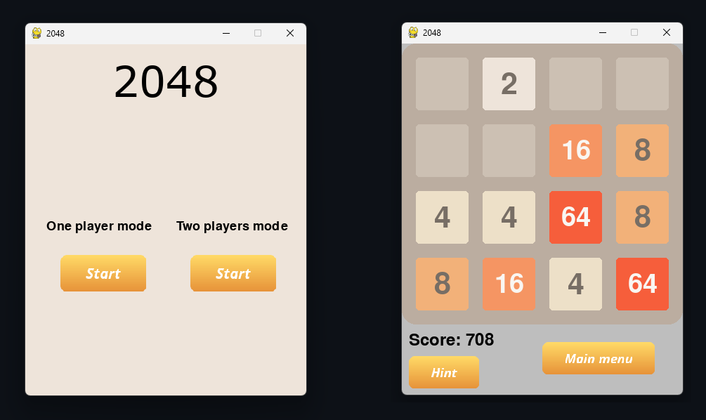
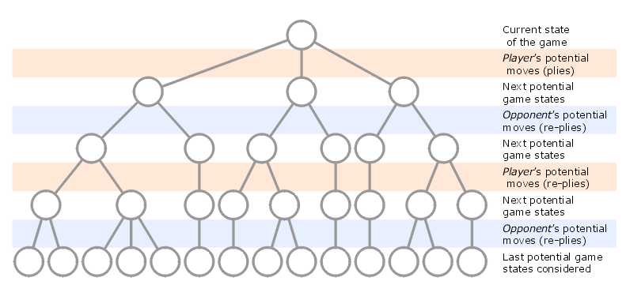

# 2048 game
#### _Project in progress_

### Introduction
The main goal of the project is to develop an algorithm using reinforcement machine learning that efficiently plays the 2048 game.

Two approaches will be compared:
- alpha beta pruning
- expectimax 

which are described a little further.
The project also includes the implementation of the game itself, in which there is a move hint system. it will be based on the most effective version of the created algorithm.

The app allows gameplay in two modes:
- one player mode - _standard 2048 gameplay_
- two player mode - _the second player determines where the next tile appears_

  

Currently, the hint system is based on an alpha-beta pruning algorithm with manually selected parameters - the effectiveness of this algorithm is low, but it provides some starting point.

## Algorithms

### Minimax
The minimax algorithm is a decision-making algorithm used in game theory for making decisions in two-player, zero-sum games like chess, go, tic-tac-toe and many others. It operates by recursively exploring the possible moves of a game state tree, where each node represents a possible state of the game, and the edges represent possible moves from one state to another.

  

The algorithm assumes that both players are rational and will always choose moves that maximize their own chance of winning while minimizing their opponent's chance of winning. It alternates between maximizing the score for the current player (maximizing player) and minimizing the score for the opponent (minimizing player) at each level of the tree. 
Originally minimax was formulated for games where both players have the same objective and set of moves. However 2048 game is slightly different. 
The setup is inherently asymmetric; that is, the computer and player take drastically different actions in their turns. Computer's actions are completely random, all he does is spawn random tiles of 2 and 4 each turn although this does not stop us from using the algorithm. We will just assume the most beneficial decisions of the computer from its perspective.
