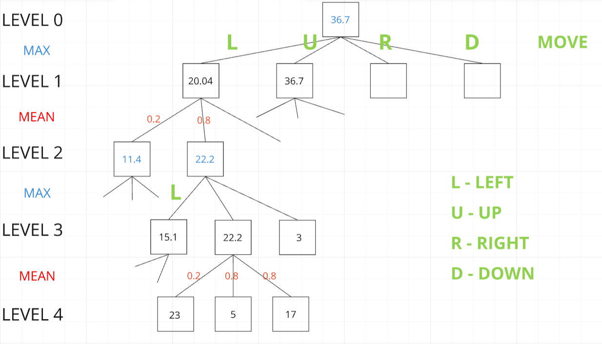

# 2048 game
#### _Project in progress_

### Introduction
The main goal of the project is to develop an algorithm using genetic algorithm that efficiently plays the 2048 game. The project was created with colleagues as a final project for a university course titled "Stochastic Methods in Machine Learning".


## Expectimax
Before each move, the algorithm creates a tree of possible game states for the next two moves. In the leaves of this tree are all possible game states after two potential moves and the game's responses. Each board state in a leaf is scored — the more beneficial the situation on the board, the higher the score.
A standard approach in two-player games (and also those where the second player's move is simulated by the game) is to use the minimax algorithm. It involves choosing the move that, when considering several moves ahead, leads to the highest gain, assuming that the opponent plays optimally. However, in our case, the assumption that the opponent plays optimally is not accurate because the appearance of a new tile is entirely random. No fields are preferred, but there is always an 80% chance of a tile with the number 2 appearing and a 20% chance of a tile with the number 4 appearing.
To account for the fact that the game's response is random, we decided to use the expectimax algorithm. It is similar to minimax, but instead of choosing the move with the highest benefit, we consider the expected value of the move — taking into account the probability that the game will proceed as we assume. The procedure to follow before each move is as follows:

<div style="text-align:center">
  
</div>

## Genetic Algorithm
The genetic algorithm operates in a standard manner, allowing for the adjustment of the following parameters:
•	population size
•	number of generations
•	number of games per individual in a generation
•	mutation rate
The algorithm works as follows: each individual in the population is defined by a set of parameters that are a linear combination of metrics. The population consists of "n" individuals. In each generation, each individual plays "m" games. After this phase, we select "n/2" individuals to be the parents for the next generation. The selection of parents is based on a probability distribution derived from their average scores in the generation. During the creation of new individuals, mutations may occur, altering any parameter to a different value. The goal of the algorithm is to gradually improve results from generation to generation, leading to an optimal combination of parameters.


## Metrics

For each terminal state in the tree, a score is returned, which is a linear combination of the created metrics. These metrics evaluate the board, assigning higher scores to more beneficial situations from the player's perspective. However, when creating these metrics, we are not always certain if they all make sense and if we should consider each of them, as each provides the algorithm with guidance for selecting the optimal move. Therefore, we use a linear combination of the metrics, where the score of each metric is multiplied by an appropriate parameter. 
Our experiments have shown that different sets of parameters influence the extent to which individual metrics contribute to the final score, and consequently to the decisions made. Some parameter sets performed better, so we use a genetic algorithm to optimize these parameters to achieve the best possible results.


##### 1) Empty tile heuristic
Essentially, this heuristic awards extra points for each empty tile on the board. Maintaining a minimal number of occupied tiles is crucial. Failing to do so results in a rapid filling of the board, leading to game over.
##### 2) Smoothness heuristic
We aim to minimize the disparity between adjacent tiles by penalizing significant differences in their values. This strategy ensures that neighboring tiles remain as close in value as possible.
##### 3) Big tiles in border heurisitc
For every tiles in the grid, we give penalty if it is placed in the middle of the grid. The amount of the penalty is _C x distance to the nearest border x tile value_ where C is some constant.
##### 4) Max value heuristic
It just return the maximum value.
##### 5) Weighted tiles heuristic
The "weighted tiles" or "snake" heuristic is a strategy that assigns weights to each tile based on its position on the board. The idea behind this heuristic is to encourage the formation of a specific pattern of values across the board that resembles the shape of a snake. By using this, the algorithm aims to maximize the potential for merging tiles and creating higher valued tiles.
```
score_grid = [2 ** 15, 2 ** 14, 2 ** 13, 2 ** 12,
                  2 ** 8, 2 ** 9, 2 ** 10, 2 ** 11,
                  2 ** 7, 2 ** 6, 2 ** 5, 2 ** 4,
                  2 ** 0, 2 ** 1, 2 ** 2, 2 ** 3]
```

## Results


