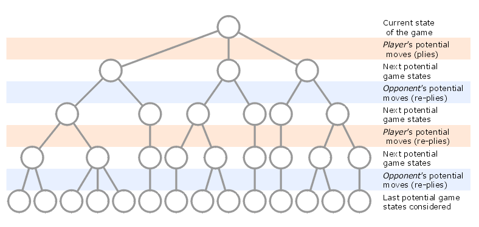

# 2048 game
#### _Project in progress_

### Introduction
The main goal of the project is to develop an algorithm using reinforcement machine learning that efficiently plays the 2048 game.

Two minimax-based approaches will be compared:
- alpha beta pruning
- expectimax 

which are described a little further.
The project also includes the implementation of the game itself, in which there is a move hint system. it will be based on the most effective version of the created algorithm.

The app allows gameplay in two modes:
- one player mode - _standard 2048 gameplay_
- two player mode - _the second player determines where the next tile appears_

<div style="text-align:center">
  
</div>

Currently, the hint system is based on an alpha-beta pruning algorithm with manually selected parameters - the effectiveness of this algorithm is low, but it provides some starting point.

## Algorithms

### Minimax
The minimax algorithm is a decision-making algorithm used in game theory for making decisions in two-player, zero-sum games like chess, go, tic-tac-toe and many others. It operates by recursively exploring the possible moves of a game state tree, where each node represents a possible state of the game, and the edges represent possible moves from one state to another. At the beginning of our recursion we have to determine an arbitrary depth at which our algorithm will stop going further, because the number of possible states is overwhelmingly high, and we don’t have enough computing power to process all of them in a rational time.

<div style="text-align:center">
  
</div>

The algorithm assumes that both players are rational and will always choose moves that maximize their own chance of winning while minimizing their opponent's chance of winning. It alternates between maximizing the score for the current player (maximizing player) and minimizing the score for the opponent (minimizing player) at each level of the tree. 
Originally minimax was formulated for games where both players have the same objective and set of moves. However 2048 game is slightly different. 
The setup is inherently asymmetric; that is, the computer and player take drastically different actions in their turns. Computer's actions are completely random, all he does is spawn random tiles of 2 and 4 each turn although this does not stop us from using the algorithm. We will just assume the most beneficial decisions of the computer from its perspective.

### Alpha-beta pruning
The minimax algorithm works fine but it has a big disadvantage - it's time and memory consuming. That's why we will take a look at some kind of optimization which is a known way to reduce the size of a minimax tree. 
Alpha–beta pruning is a search algorithm that seeks to decrease the number of nodes that are evaluated by the minimax algorithm in its search tree. It stops evaluating a move when at least one possibility has been found that proves the move to be worse than a previously examined move. Such moves need not be evaluated further. When applied to a standard minimax tree, it returns the same move as minimax would, but prunes away branches that cannot possibly influence the final decision.
<div style="text-align:center">
  
</div>

### Expectimax
Since 2048 is a stochastic game, perhaps a better idea would be to use an algorithm for such cases.
Expectimax is an another variation of the minimax algorithm. The difference is that minimax assumes that the adversary plays optimally but the expectimax doesn’t.
In this algorithm, when assessing the opponent's node, we compute all potential moves, taking into account their probabilities. Essentially, we determine the expected value of the gain across all conceivable scenarios. In most instances, the likelihood of each node is equal. In our scenario, playing 2048, these probabilities are predetermined. The distribution of empty tiles is uniform, with a 90% chance of appearing a 2 and a 10% chance of appearing a 4.
There are some articles where people report that they get really good results using this approach - so I decided to check it out.


## Heuristics

Once the tree is created, the next crucial step is to create some heuristics, that allows us to evaluate the score of the board of each terminal state. We need it to be reliable in any case. Our score will be a sum of specific heuristics we choose. While doing some research, I found several heuristics that i will breifly describe:

##### 1) Empty tile heuristic
Essentially, this heuristic awards extra points for each empty tile on the board. Maintaining a minimal number of occupied tiles is crucial. Failing to do so results in a rapid filling of the board, leading to game over.
##### 2) Smoothness heuristic
We aim to minimize the disparity between adjacent tiles by penalizing significant differences in their values. This strategy ensures that neighboring tiles remain as close in value as possible.
##### 3) Monotonicity heristic
This heuristic focuses on maintaining a consistent trend in tile values, whether increasing or decreasing, both horizontally and vertically. By doing so, it prevents smaller valued tiles from becoming isolated and promotes a well-organized board where smaller tiles merge into larger ones, maintaining a cascading effect.
##### 4) Big tiles in border heurisitc
For every tiles in the grid, we give penalty if it is placed in the middle of the grid. The amount of the penalty is _C x distance to the nearest border x tile value_ where C is some constant.
##### 5) Max value heuristic
It just return the maximum value.
##### 6) Weighted tiles heuristic
The "weighted tiles" or "snake" heuristic is a strategy that assigns weights to each tile based on its position on the board. The idea behind this heuristic is to encourage the formation of a specific pattern of values across the board that resembles the shape of a snake. By using this, the algorithm aims to maximize the potential for merging tiles and creating higher valued tiles.
```
score_grid = [2 ** 15, 2 ** 14, 2 ** 13, 2 ** 12,
                  2 ** 8, 2 ** 9, 2 ** 10, 2 ** 11,
                  2 ** 7, 2 ** 6, 2 ** 5, 2 ** 4,
                  2 ** 0, 2 ** 1, 2 ** 2, 2 ** 3]
```


References: 

https://en.wikipedia.org/wiki/Minimax

https://en.wikipedia.org/wiki/Alpha%E2%80%93beta_pruning

https://azaky.github.io/2048-AI/paper.pdf

